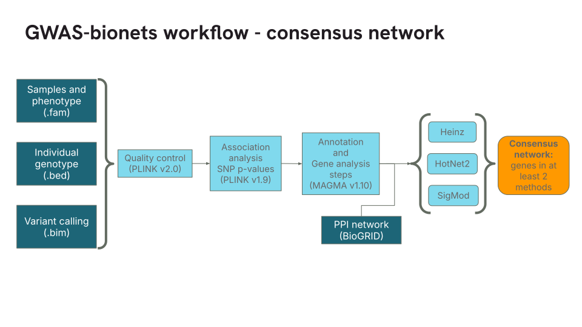

# gwas-bionets

gwas-bionets is a repository to run different biological network methods, namely [Heinz](https://academic.oup.com/bioinformatics/article/24/13/i223/231653?login=true), [HotNet2](https://www.nature.com/articles/ng.3168), and [SigMod](https://academic.oup.com/bioinformatics/article/33/10/1536/2874362). The input is a typical fileset for GWAS analysis in PLINK 1.9 format (.bim, .bed and .fam). The general workflow for constructing a consensus network is as follows:

[](img/consensus_pipeline.svg)

And for generating a stable consensus network (when the _k_ parameter is greater than 1) the correspoding pipeline is:

[](img/stable_consensus_pipeline.svg)

For the latter image, we used _k_=5 as illustration but you can change to a greater number which makes sense in your experiments. Also, 1H,2H, ... corresponds to the solutions outputted by Heinz; 1N, 2N, ... solutions of HotNet2; and 1S, 2S, ... solutions of SigMod. We omitted the filtering step in the pipeline, so please ensure your data is filtered prior. We used BioGRID as a source for the PPI, but you can choose another network of reference, considering a two-column header indicating the connection between two molecules (genes, proteins, ...) as the format, i.e., 'Official Symbol Interactor A' and 'Official Symbol Interactor B'.

## Software requirements

This code uses software already outdated so it is encouraged to follow the installation process; otherwise, it may not work. An update of the methods and requirements is planned but still needs to be carried out. Due to not having administrative rights or to avoiding conflicts, most software needs to be installed locally or within an environment, and paths to these installations must be redirected. It is assumed that you run these commands on a Unix-like machine.

Ideally, create a folder in your home directory to store all software. For example:

```bash
mkdir ~/bin
```

**Install Java (required for installing nextflow)**

Create a "java" folder in the software directory and navigate to it.

```bash
mkdir ~/bin/java
cd ~/bin/java
```

Download the `x64` version of Java as a `tar.gz` file from the Oracle website into your machine and decompress it.

```bash
wget https://download.oracle.com/java/17/archive/jdk-17.0.10_linux-x64_bin.tar.gz
tar xzfv jdk-17.0.10_linux-x64_bin.tar.gz 
rm jdk-17.0.10_linux-x64_bin.tar.gz
```

Export the path to the `bin` directory of this folder into the system variable `$PATH` to make Java executable. Also, export the `$JAVA_HOME` variable indicating the root directory. Ideally, add these to `~/.bashrc` to avoid repeating the process on each server connection or reboot, eg.

```bash
export PATH=$PATH:/home/username/bin/java/jdk-17.0.10/bin
export JAVA_HOME=/home/username/bin/java/jdk-17.0.10
```

You may need to source `.bashrc` file before checking installation, so type:

```bash
source ~/.bashrc
```

Test the installation:

```bash
java -version
```

You should see something like:

```bash
openjdk version "11.0.17" 2022-10-18
OpenJDK Runtime Environment (build 11.0.17+8-post-Ubuntu-1ubuntu220.04)
OpenJDK 64-Bit Server VM (build 11.0.17+8-post-Ubuntu-1ubuntu220.04, mixed mode, sharing)
```

**Install Nextflow**

Create a "nextflow" folder in the software directory and navigate to it.

```bash
mkdir ~/bin/nextflow
cd ~/bin/nextflow
```

Download Nextflow version 22.10.4 and decompress:

```bash
wget https://github.com/nextflow-io/nextflow/archive/refs/tags/v22.10.4.tar.gz
tar -xzvf /gwas-bionets/nextflow/nextflow-22.10.4.tar.gz
```

Compile and install it:

```bash
make compile
make pack
make install
```

Add to your path:

```bash
export PATH=$PATH:/home/username/bin/nextflow
```

Test the installation:

```bash
nextflow -version
```

**Install MAGMA**

You can follow the installation instructions for MAGMA at its website (version 1.10): [Multi-marker Analysis of GenoMic Annotation](https://cncr.nl/research/magma/). According to the documentation MAGMA: is a self-contained executable and does not need to be installed. 

**Install PLINK**

Similarly, you can install PLINK (version 1.9) from its website: [population linkage](https://www.cog-genomics.org/plink/1.9/). PLINK is also self-contained executable so either you add to your path or reference the executable when using it. 

**Install R and some packages (required for the methods)**

If you dont't have R installed in your machine (add your superuse credentials if needed to install software), then proceed as follows:

```bash
wget -qO- https://cloud.r-project.org/bin/linux/ubuntu/marutter_pubkey.asc | tee -a /etc/apt/trusted.gpg.d/cran_ubuntu_key.asc
add-apt-repository "deb https://cloud.r-project.org/bin/linux/ubuntu $(lsb_release -cs)-cran40/"
apt-get -y install --no-install-recommends r-base r-base-dev
```

Setup the general CRAN repo.

```bash
echo 'local({
    r <- getOption("repos")
    r["CRAN"] = "https://cloud.r-project.org/"
    options(repos = r)
  })' >> /etc/R/Rprofile.site
```

Install Bioconductor, `twilight` and `BioNet` (the latter contains the necessary files to use Heinz method).

```bash
R -e "if (!requireNamespace('BiocManager', quietly = TRUE))
            install.packages('BiocManager')"
R -e "BiocManager::install('BioNet')"
R -e "BiocManager::install('twilight')"
```

Install R packages, `tidyverse`, `cowplot`, `igraph` and `gprofiler2`:

```bash
R -e "install.packages(c('tidyverse', 'cowplot', 'igraph', 'gprofiler2'))" 
```

**Install Python2**

HotNet2 uses python2 to run some of its scripts; nowadays, it may be troublesome to install python 2.7 so we suggest to use a conda environment (although, we did not follow this alternative).

```bash
apt-get -y install python2-dev python2 python-pip
```

Add some python2 libraries needed for HotNet2:

```bash
pip2 install numpy==1.12.1 scipy==0.19.0 networkx==1.11 h5py==2.7.0
```

**Install SigMod**

You can install SigMod (version 2) from this website: [Strongly Interconnected Gene MODule](https://github.com/YuanlongLiu/SigMod/tree/20c561876d87a0faca632a6b93882fcffd719b17). This is an R package and it suffices to assign the parameter `sigmod_path` when calling the `bionets.nf` script, eg. `--sigmod_path="~/bin/SigMod_v2"`.

**Install HotNet2**

You can install HotNet2 from this website: [HotNet2](https://github.com/raphael-group/hotnet2). Save the code in a folder and name it `hotnet2` whose location can therefore reference in the parameter `hotnet2_path` when calling `bionets.nf` script, eg. `--hotnet2_path="~/bin/hotnet2"`

**Install Heinz**

You have already installed when installing the `BioNet` package from Bioconductor :-)

After that, we are all set!

## Main Scripts

1. This script works with the raw data for splitting it if parametrized with the _k_ parameter. The script has the needed parameters to be filled by the user, clearly, you can run each of the steps within the script separately.

`bionets_construction_from_data.sh`

2. This script works with the scores previously computed using a software like [MAGMA](https://cncr.nl/research/magma/) for the gene P-values. Again, a _k_ parameter greater than 1 generates k-fold solutions. As above, we conceived the script to be modified to provide the parameters.

`bionets_construction_from_scores.sh`

